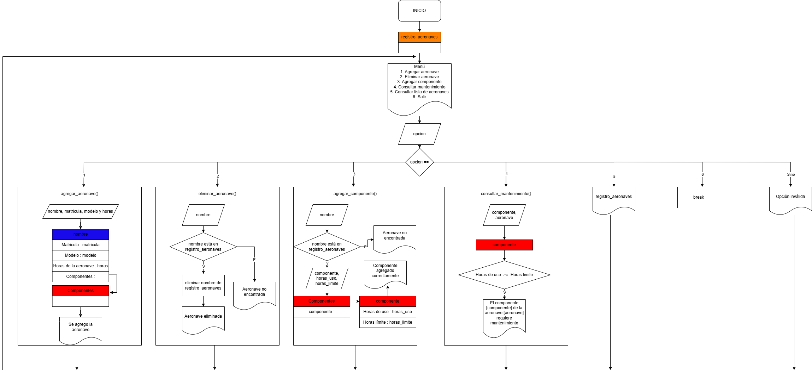
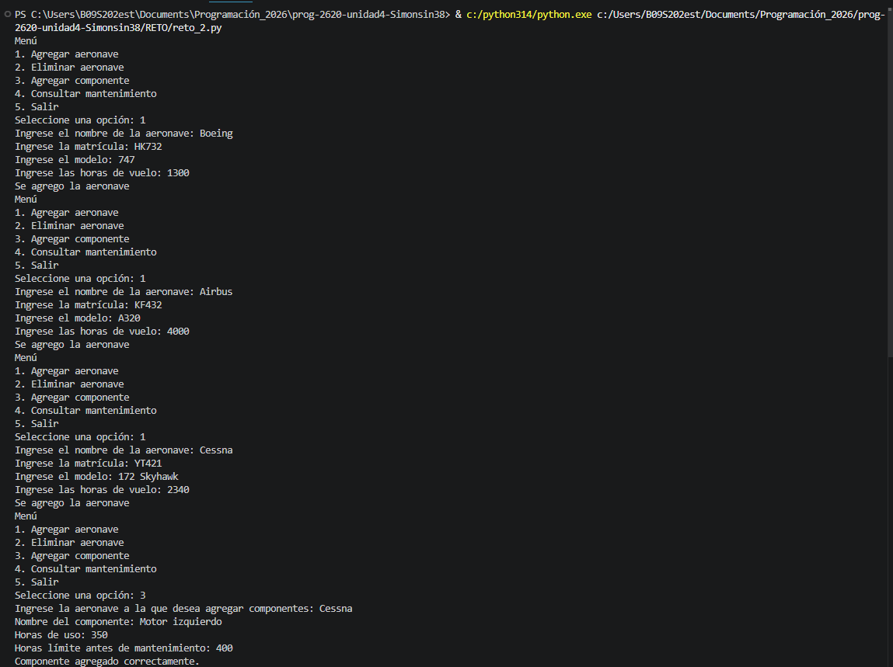
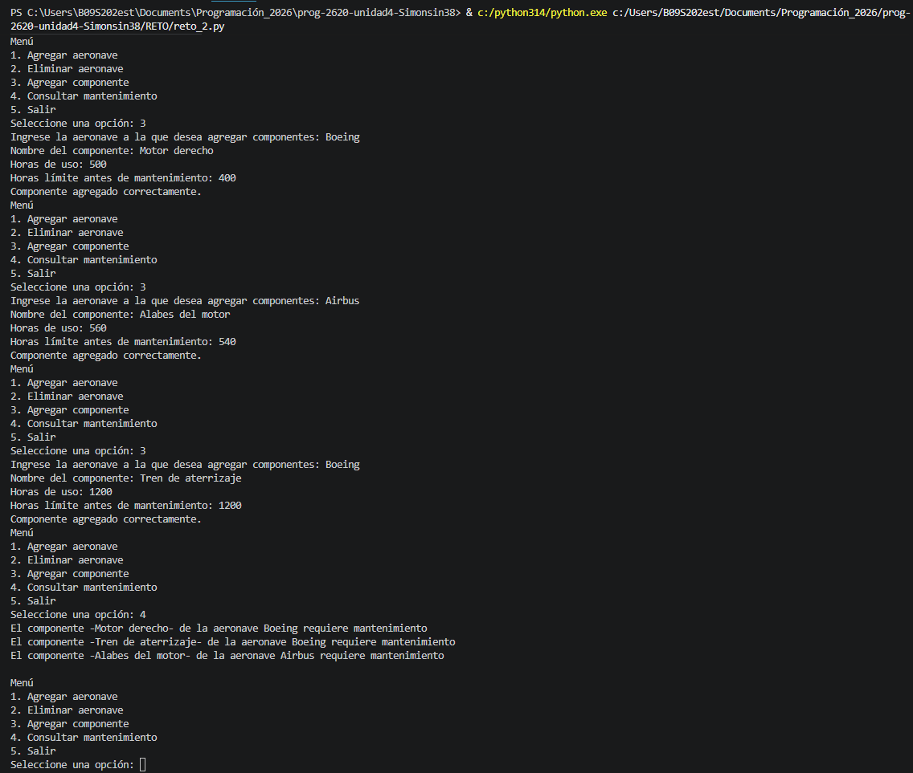

# 📝 Plantilla de Autoevaluación: Gestión de Mantenimiento de Flota Aeronáutica ✈️

**Instrucciones para los estudiantes:**
1. Hagan una copia de este archivo y guárdenlo en la raíz de su repositorio con el nombre `AUTOEVALUACION.md`.
2. Lean cuidadosamente cada criterio de la rúbrica.
3. En el apartado **Nota Esperada**, asignen una calificación numérica (de 0.0 a 5.0) que consideren justa para su trabajo en ese criterio.
4. En el apartado **Justificación**, expliquen con sus propias palabras por qué merecen esa nota. Sean críticos y honestos.
5. En el apartado **Evidencia**, inserten pantallazos de la ejecución de la consola, imágenes de su diagrama o bloques de código (usando la sintaxis de Markdown con \`\`\`) que respalden su justificación.
6. Al final, calculen su nota definitiva esperada según los porcentajes.

---

## 👥 1. Información del Equipo
* **Miembro 1:** [Simón Osorio Estrada] - [000579174]

---

## 📊 2. Evaluación por Criterios

### Criterio 1: Diagrama y Lógica (Valor: 20%)
*Evalúa si el diagrama es claro, lógico y representa fielmente la estructura de datos utilizada (listas/diccionarios) y el flujo del programa.*

* **Nota Esperada (0.0 - 5.0):** 4.5
* **Justificación:** 
  > Consideramos que merecemos un 4 dado que logramos el objetivo del reto, dedicamos suficiente tiempo a pensar en posibles soluciones y prácticamente reescribimos el código desde cero, sin embargo, pensamos que no llegamos al 5 por que quizas el gráfico de como funciona el código puede llegar a ser algo confuso si no se explica de antemano.
* **Evidencia:**
 
 En el diagrama inicialmente presentamos un menú el cual nos pide ingresar una opción que nos lleva a distintas operaciones. Dividimos 4 funciones con cuadrados que contienen las operaciones que se llevan a cabo o que se espera que se lleven a cabo, además hay otras 3 opciones las cuales no son funciones pero pueden ser utiles. En el código los cuadrados se vuelven funciones ya definidas para cada una de las opciones, al final se incluye el menú dentro de un bucle que no acabara a no ser que el usuario le de a la opción 6 la cual es la opción de salir, esta hace un break en el bucle y cierra el ciclo. Cada opción llama a una de las funciones a excepción de la 5, la 6 y cualquier otra opción que no aparezca en la lista, estas ultimás dan directamente un resultado como un print del diccionario principal, el break ya mencionado o una opción inválida.

### Criterio 2: Uso de Estructuras (Listas y Diccionarios) (Valor: 30%)
*Evalúa si se utilizaron diccionarios y listas de manera correcta y anidada para almacenar los datos ingresados por el usuario, sin redundancias.*

* **Nota Esperada (0.0 - 5.0):** 5
* **Justificación:**
  > Para la memoria usamos un diccionarío principal al cual se añaden todas las aeronaves que se desean añadir, inicialmente es un diccionario vacío, con la función agregar_aeronave() se añaden las aeronaves añadiendo no solo su nombre sino tambien su valor que a su vez es otro diccionario, el cual se rellena con otros datos como el modelo y la matricula, además por cada aeronave se crea un diccionario vacío dentro del diccionario de la aeronave unicamente para los componentes de esa aeronave. En general son diccionarios dentro de diccionarios que se editan gracias a las funciones.
* **Evidencia:**
  ```python
  # Diccionario vacío.
  registro_aeronaves = {}
  # Se añade un diccionario al diccionario principal, el cual a su vez crea un elemento ("Componentes") que es un diccionario vacío.
  registro_aeronaves[nombre] = {
        "Matricula": matricula, "Modelo": modelo, "Horas de la aeronave": horas,
        "Componentes": {}
    }
  # En esta parte se puede ver como se agregan componentes a un diccionario de aeronave especifico.
  nombre = input("Ingrese la aeronave a la que desea agregar componentes: ")
    if nombre in registro_aeronaves:
        componente = input("Nombre del componente: ")
        horas_uso = float(input("Horas de uso: "))
        horas_limite = float(input("Horas límite antes de mantenimiento: "))

        registro_aeronaves[nombre]["Componentes"][componente] = {
            "Horas de uso": horas_uso,
            "Horas Limite": horas_limite
        }
  
  ```
  # Reemplaza esto con tu fragmento de código real
  flota = {}
  # ... código de inserción de datos ...

### Criterio 3: Cumplimiento de Restricciones Técnicas (Valor: 20%)
*Evalúa el respeto total a las reglas: uso de ciclos clásicos (for/while), cero uso de list comprehensions, y ninguna librería/función avanzada no vista en clase.*

* **Nota Esperada (0.0 - 5.0):** 5
* **Justificación:**
    > Seguimos las reglas al pie de la letra.
* **Evidencia:** 
```python
def consultar_mantenimiento():
    for aeronave, datos in registro_aeronaves.items():
        for componente, info in datos["Componentes"].items():
            if info["Horas de uso"] >= info["Horas Limite"]:
                print(f"El componente -{componente}- de la aeronave {aeronave} requiere mantenimiento")
    print()
```
### Criterio 4: Funcionalidad del Código (Valor: 15%)
*Evalúa si el programa pide datos correctamente, no se "crashea" y genera el reporte final de mantenimiento esperado.*

* **Nota Esperada (0.0 - 5.0):** 5
* **Justificación:**
    > El sistema muestra el menú con sus respectivas 6 opciones, se selecciona la opción de agregar y se agrega exitosamente, después el programa vuelve al menú, se repite el agregar aeronave dos veces más y sigue siendo exitoso. Se selecciona la opción de agregar componente y se agregan 4 componentes con sus respectivas horas de uso y horas limite para aeronaves distintas de forma exitosa, finalmente se selecciona la opción de consultar mantenimiento y el programa muestra únicamente los componentes que requieren mantenimiento.
* **Evidencia:** 


### Criterio 5: Preparación para Sustentación (Valor: 15%)
*Aunque esta nota la dará el profesor en la entrevista oral, autoevalúen su nivel de preparación y comprensión del código que entregaron.*

* **Nivel de Confianza (Bajo / Medio / Alto):** Alto
* **Justificación:**
    > Personalmente entiendo completamente el funcionamiento del código sin necesidad de mirar los apuntes, me veo en la capacidad de responder cualquier pregunta relacionada al código.
* **Evidencia de preparación: 
    Mi compañero no dominaba el tema, trate de explicarle durante la elaboración del código pero tenia varios problemas con la estructura en python, por ende se le olvidaba fácilmente el código.

### 📈 3. Cálculo de Nota Definitiva Esperada
Multipliquen la nota asignada en cada criterio por su porcentaje respectivo y sumen los resultados para obtener su nota final esperada.

|Criterio	|Nota |Asignada	|Peso	|Subtotal |(Nota * Peso) |
|---|---|---|---|---|---|
|1. Diagrama y Lógica	|[4.5]	|20% |(0.2)	|[0.9]|
|2. Uso de Estructuras	|[4.5]	|30% |(0.3)	|[1.35]|
|3. Cumplimiento Restricciones|	[5]	|20% |(0.2)	|[1]|
|4. Funcionalidad	|[5]	|15% |(0.15)	|[0.75]|
|5. Sustentación (Estimado)|	[5]|	15%| (0.15)|	[0.75]|

NOTA FINAL ESPERADA		100%	[4.75]

✨ ""La educación es para el carácter, no solo para la mente"." ✨